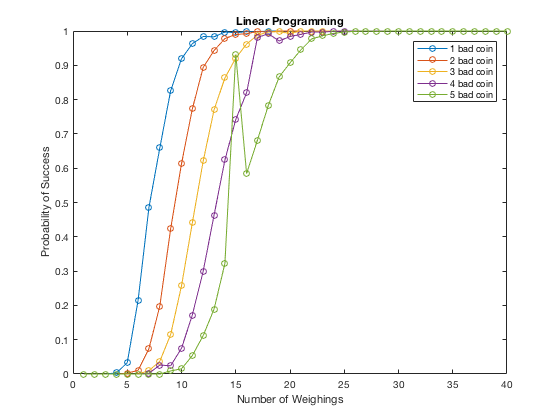
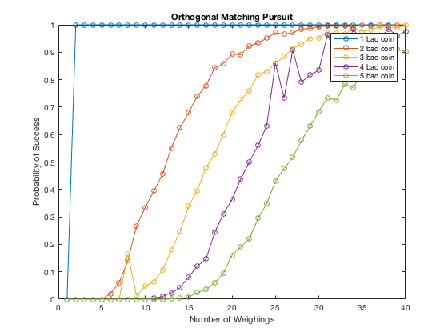

# Compressed Sensing
Use linear programming and orthogonal matching pursuit solve bad coins problem.

## Linear Programming
Elapsed time is 2337.948377 seconds (around 39 mins).

  

## Orthogonal Matching Pursuit
Elapsed time is 22.306648 seconds.

  

## Reference
* Bruckstein, Alfred M., David L. Donoho, and Michael Elad. "From sparse solutions of systems of equations to sparse modeling of signals and images." SIAM review 51.1 (2009): 34-81.
* Bryan, Kurt, and Tanya Leise. "Making do with less: an introduction to compressed sensing." SIAM Review 55.3 (2013): 547-566.
